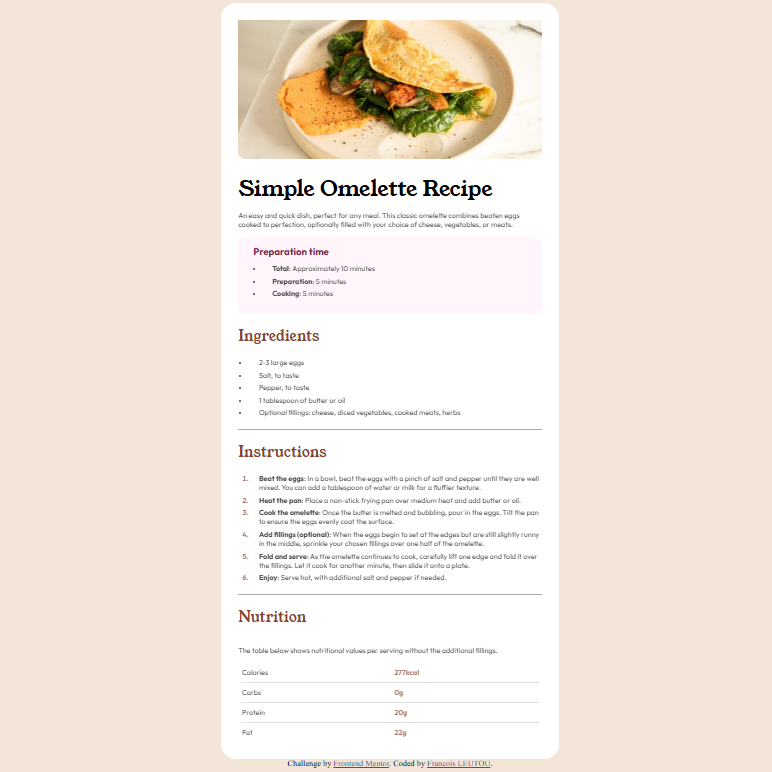

# Frontend Mentor - QR code component solution

This is a solution to the [Recipe Page challenge on Frontend Mentor](https://www.frontendmentor.io/learning-paths/getting-started-on-frontend-mentor-XJhRWRREZd). Frontend Mentor challenges help you improve your coding skills by building realistic projects. 

## Table of contents

- [Overview](#overview)
  - [Screenshot](#screenshot)
  - [Links](#links)
- [My process](#my-process)
  - [Built with](#built-with)
  - [What I learned](#what-i-learned)
- [Author](#author)

## Overview

### Screenshot

### Links

- Solution URL: [Solution](https://github.com/FrancisL0001/Recipe-Page)
- Live Site URL: [Live Site](https://recipe-page-flax-psi.vercel.app/)

## My process

### Built with

- Semantic HTML5 markup
- CSS custom properties
- Flexbox
- CSS Grid
- Mobile-first workflow

### What I learned

In this challenge, I learned positioning of  items in ol and uls efficiently. I also had fun figuring out how to position and style the elements of a table I used to enter the Nutrition. this is pretty much everything new I used.

## Author

- Frontend Mentor - [FrancisL0001](https://www.frontendmentor.io/profile/FrancisL0001)
- GitHub - [FrancisL0001](https://github.com/FrancisL0001)

